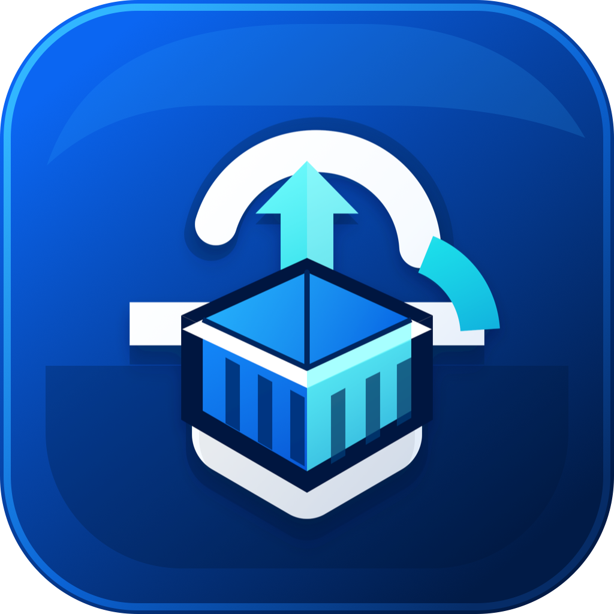

<a id="top"></a>

<div align="center">
  
  <h1>Harbor Visible Kit</h1>
  <p><strong>A Flutter desktop toolkit for browsing, publishing, and extracting Harbor registry artifacts.</strong></p>
  <p>
    <a href="#中文">中文</a>
    |
    <a href="#english">English</a>
  </p>
  <p>
    
    
    
    
  </p>
</div>

> GitHub does not run custom JavaScript in README files. This document uses native anchors and `<details>` panels for a GitHub-compatible language switch.

<a id="中文"></a>

<details open>
<summary><strong>中文</strong></summary>

## 项目简介

Harbor Visible Kit 是一个 Flutter 桌面应用，用于以图形化方式管理 Harbor Registry 中的制品。它面向需要频繁发布、浏览、下载和提取交付包的团队，降低手动拼接镜像地址、处理归档包和重复操作 Registry API 的成本。

当前项目主要覆盖 Windows 与 macOS 桌面端。

## 功能特性

- 连接 Harbor：保存服务器、用户名和可选密码，并通过 Harbor v2.0 API 验证连通性和账号认证。
- 浏览资源：读取 Harbor 项目空间、仓库、制品和版本标签。
- 批量推送：支持 JAR 服务包、Docker/OCI 镜像归档、Web 前端包和 Android APK。
- 目标预览：推送前展示解析后的仓库名、版本、标签和完整镜像引用。
- 版本复用：从 Harbor 中读取已有标签，辅助选择或复用版本号。
- 批量下载：按项目、制品类型、仓库和版本加入下载队列。
- 文件提取：将 JAR、Web 包、APK 从 Registry 制品中提取为本地文件，将镜像导出为 Docker save 归档。
- 本地偏好：保存连接配置、推送配置、主题和应用语言。
- 语言切换：应用内支持简体中文与 English。
- 主题切换：支持跟随系统、浅色和深色模式。

## 支持的制品类型

| 类型 | 输入文件 | 仓库规则 | 标签规则 | 下载/导出结果 |
| --- | --- | --- | --- | --- |
| JAR 服务包 | `*.jar` | 默认解析为 `<jar-name>-artifacts` | `<version>-jar` | 提取为原始 JAR 文件 |
| Docker/OCI 镜像归档 | `*.tar`, `*.tar.gz`, `*.tgz` | 从 `<repo>-docker-image-<version>` 解析，必要时可手动填写 | `<version>` | 导出为 `*-docker-image-*.tar.gz` |
| Web 前端包 | `dist.zip` | 固定为 `web` | `<version>` | 提取为 `dist.zip` |
| Android APK | `*.apk` | 从文件名或手动仓库名解析 | `<version>` 或 `<version>-<build>` | 提取为 APK 文件 |

APK 文件可选命名格式：

```text
AppName V1.2.3 build45.apk
```

镜像归档建议命名格式：

```text
example-service-docker-image-1.2.3.tar.gz
```

## 工作流程

### 1. 配置连接

1. 打开 `Connection` 页面。
2. 新增或选择 Harbor 服务器。
3. 输入端口、用户名和密码。
4. 点击连接，应用会调用 `/api/v2.0/systeminfo` 与 `/api/v2.0/users/current` 验证 Harbor 和账号。

### 2. 推送制品

1. 打开 `Push artifacts` 页面。
2. 选择项目空间、制品类型和版本标签。
3. 选择或拖入本地文件。
4. 检查目标预览，必要时修正仓库名。
5. 执行批量推送。

### 3. 拉取制品

1. 打开 `Pull artifacts` 页面。
2. 选择项目空间、制品类型、仓库和版本。
3. 将目标加入下载队列。
4. 选择本地保存目录。
5. 下载并提取制品。

## 环境要求

- Flutter stable，Dart SDK 版本需满足 `pubspec.yaml` 中的 `^3.11.4`。
- Windows 或 macOS 桌面环境。
- 可访问目标 Harbor Registry 的网络环境。
- 拥有对应 Harbor 项目的浏览、拉取、推送或创建权限。

> 当前实现通过 Harbor API 与 Registry HTTP API 处理受支持的上传、下载和导出流程。镜像归档输入应是 Docker save 或 OCI 兼容归档。

## 快速开始

安装依赖：

```bash
flutter pub get
```

运行 Windows 版本：

```bash
flutter run -d windows
```

运行 macOS 版本：

```bash
flutter run -d macos
```

执行检查和测试：

```bash
flutter analyze
flutter test
```

构建桌面应用：

```bash
flutter build windows
flutter build macos
```

## 项目结构

```text
lib/
  app/                 应用外壳、主题、本地化和全局状态
  core/                通用组件与平台工具
  data/                Harbor API、Registry API 和归档处理
  domain/              Harbor 与制品领域模型、命名和解析规则
  features/
    connection/        Harbor 连接配置页面
    push/              制品推送页面
    pull/              制品下载和提取页面
    settings/          主题、语言和应用信息设置
assets/                应用图标等静态资源
docs/                  额外说明文档
test/                  单元测试和 Widget 测试
windows/, macos/       桌面平台工程
```

## 关键依赖

| 依赖 | 用途 |
| --- | --- |
| `dio` | Harbor API 与 Registry API HTTP 客户端 |
| `provider` | 状态管理 |
| `shared_preferences` | 本地配置持久化 |
| `desktop_drop` | 桌面拖拽文件 |
| `file_picker` | 选择文件和目录 |
| `window_manager` | 桌面窗口管理 |
| `archive` | 归档处理 |
| `crypto` | Digest 计算 |

## 文档

- [Harbor Artifact Workflow](docs/harbor-artifact-workflow.md)：制品发布和下载流程示例。
- [Security Policy](SECURITY.md)：安全策略。

## 安全说明

如果启用记住密码，当前实现会通过 Flutter `shared_preferences` 将 Harbor 密码保存到本地应用偏好中。这不是 Windows Credential Manager 或 macOS Keychain 一类的系统级加密凭据存储。

公开发布前请确认：

- 仓库内没有真实 Harbor 地址、账号、密码、Token 或内部项目名称。
- 没有提交构建产物、临时文件、本地 IDE 配置或工具索引。
- 曾经出现在私有文档或历史记录中的凭据已经轮换。

## 开源发布建议

建议以干净快照发布，而不是直接公开包含私有历史的仓库。发布前可执行：

```bash
flutter analyze
flutter test
git status --short
```

## 许可证

本项目基于 MIT License 发布，详情见 [LICENSE](LICENSE)。

<p align="right"><a href="#top">返回顶部</a> | <a href="#english">English</a></p>

</details>

<a id="english"></a>

<details>
<summary><strong>English</strong></summary>

## Overview

Harbor Visible Kit is a Flutter desktop application for managing artifacts in a Harbor Registry through a visual workflow. It is designed for teams that frequently publish, browse, download, and extract delivery packages without repeatedly assembling image references or handling registry operations by hand.

The app currently targets Windows and macOS desktop builds.

## Features

- Harbor connection setup: save servers, usernames, optional passwords, and validate access through the Harbor v2.0 API.
- Registry browsing: load Harbor projects, repositories, artifacts, and version tags.
- Batch publishing: push JAR service packages, Docker/OCI image archives, Web frontend packages, and Android APK files.
- Target preview: review resolved repository names, versions, tags, and full registry references before pushing.
- Version reuse: read existing Harbor tags and use them as version candidates.
- Batch download: collect artifact versions into a download queue.
- File extraction: extract JAR, Web packages, and APK files from registry artifacts, or export images as Docker save archives.
- Local preferences: persist connection settings, push presets, theme, and app language.
- Language switch: Simplified Chinese and English are supported in the app.
- Theme switch: system, light, and dark modes are supported.

## Supported Artifact Types

| Type | Input file | Repository rule | Tag rule | Download/export output |
| --- | --- | --- | --- | --- |
| JAR service package | `*.jar` | Defaults to `<jar-name>-artifacts` | `<version>-jar` | Original JAR file |
| Docker/OCI image archive | `*.tar`, `*.tar.gz`, `*.tgz` | Parsed from `<repo>-docker-image-<version>`, or entered manually | `<version>` | `*-docker-image-*.tar.gz` |
| Web frontend package | `dist.zip` | Fixed as `web` | `<version>` | `dist.zip` |
| Android APK | `*.apk` | Parsed from file name or manual repository name | `<version>` or `<version>-<build>` | APK file |

Optional APK naming format:

```text
AppName V1.2.3 build45.apk
```

Recommended image archive naming format:

```text
example-service-docker-image-1.2.3.tar.gz
```

## Workflow

### 1. Configure Connection

1. Open the `Connection` page.
2. Add or choose a Harbor server.
3. Enter the port, username, and password.
4. Connect. The app validates Harbor and account access through `/api/v2.0/systeminfo` and `/api/v2.0/users/current`.

### 2. Push Artifacts

1. Open the `Push artifacts` page.
2. Choose a project namespace, artifact type, and version tag.
3. Select or drag local files into the app.
4. Review the target preview and correct repository names if needed.
5. Start the batch push.

### 3. Pull Artifacts

1. Open the `Pull artifacts` page.
2. Choose a project namespace, artifact type, repository, and version.
3. Add the selected version to the download queue.
4. Choose a local output directory.
5. Download and extract the artifacts.

## Requirements

- Flutter stable with a Dart SDK compatible with `^3.11.4` in `pubspec.yaml`.
- Windows or macOS desktop environment.
- Network access to the target Harbor Registry.
- Harbor credentials with the required project permissions for browsing, pulling, pushing, or project creation.

> The current implementation uses Harbor API and Registry HTTP API for supported upload, download, and export flows. Image archive inputs should be Docker save or OCI-compatible archives.

## Quick Start

Install dependencies:

```bash
flutter pub get
```

Run on Windows:

```bash
flutter run -d windows
```

Run on macOS:

```bash
flutter run -d macos
```

Run checks and tests:

```bash
flutter analyze
flutter test
```

Build desktop apps:

```bash
flutter build windows
flutter build macos
```

## Project Structure

```text
lib/
  app/                 App shell, theme, localization, and global state
  core/                Shared widgets and platform utilities
  data/                Harbor API, Registry API, and archive handling
  domain/              Harbor and artifact models, naming, and resolution rules
  features/
    connection/        Harbor connection page
    push/              Artifact publishing page
    pull/              Artifact download and extraction page
    settings/          Theme, language, and app information settings
assets/                Static assets such as the app icon
docs/                  Additional documentation
test/                  Unit and widget tests
windows/, macos/       Desktop platform projects
```

## Key Dependencies

| Dependency | Purpose |
| --- | --- |
| `dio` | Harbor API and Registry API HTTP client |
| `provider` | State management |
| `shared_preferences` | Local preference persistence |
| `desktop_drop` | Desktop file drag and drop |
| `file_picker` | File and directory picking |
| `window_manager` | Desktop window management |
| `archive` | Archive processing |
| `crypto` | Digest calculation |

## Documentation

- [Harbor Artifact Workflow](docs/harbor-artifact-workflow.md): example artifact publishing and download workflow.
- [Security Policy](SECURITY.md): security policy.

## Security Notes

If password remembering is enabled, the current implementation stores remembered Harbor passwords in local app preferences through Flutter `shared_preferences`. This is not encrypted system credential storage such as Windows Credential Manager or macOS Keychain.

Before publishing publicly, verify that:

- No real Harbor hosts, usernames, passwords, tokens, or internal project names are committed.
- Build outputs, temporary files, local IDE settings, and tool indexes are not committed.
- Any credential that ever appeared in private documentation or history has been rotated.

## Open Source Publishing Notes

Publish from a clean snapshot rather than exposing private repository history. Before release, consider running:

```bash
flutter analyze
flutter test
git status --short
```

## License

Harbor Visible Kit is released under the MIT License. See [LICENSE](LICENSE).

<p align="right"><a href="#top">Back to top</a> | <a href="#中文">中文</a></p>

</details>
